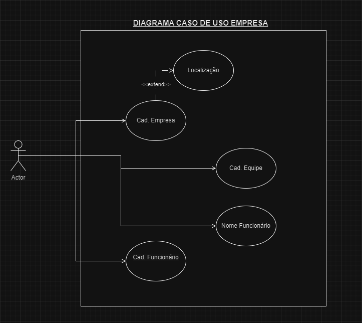
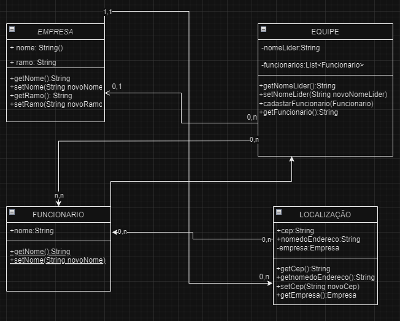
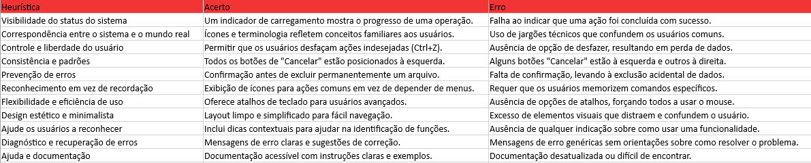

-  We see three critical differences between programming and software engineering: time, scale,
and the trade-offs at play. On a software engineering project, engineers need to be more concerned 
with the passage of time and the eventual need for change. In a software engineering organization, 
we need to be more concerned about scale and efficiency, both for the software we produce as well as for the organization 
that is producing it. Finally, as software engineers, we are asked to make more complex decisions
with higher-stakes outcomes, often based on imprecise estimates of time and growth.
-----------------------------------------------------------------------------------------------------------------------------------------------------------------------------------------------------------------------------
-  Basicamente a engenharia de software se baseia na gestão de tempo,  escala
e trade-offs, é uma profissão em que os engenheiros precisam saber lidar
com as mudanças que podem ocorrer nos projetos ao longo do tempo, o que
afeta diretamente no processo de organização da engenharia, é importante
também se preocupar com a escala da eficiência, pois também afeta todo o
processo de produção, finalmente a engenharia de software é responsável
por responder as questões mais complexas e de alto risco para gerar estimativas
de tempo e crescimento, vale se atentar para o fato de que, se for um trabalho
desleixado pode gerar dados imprecisos.
-----------------------------------------------------------------------------------------------------------------------------------------------------------------------------------------------------------------------------
-  Within Google, we sometimes say, “Software engineering is programming integrated over time.” 
Programming is certainly a significant part of software engineering: after all, programming is 
how you generate new software in the first place. If you accept this distinction, it also becomes 
clear that we might need to delineate between programming tasks (development) and software engineering 
tasks (development, modification, maintenance). The addition of time adds an important new dimension to 
programming. Cubes aren’t squares, distance isn’t velocity. Software engineering isn’t programming.
-----------------------------------------------------------------------------------------------------------------------------------------------------------------------------------------------------------------------------
-  basicamente pelo google podemos encontrar que engenharia de software é uma programação integrada ao longo do tempo.
e que programação certamente é uma parte significantiva da engenharia de programação: depois de tudo, programação
é sobre com você cria e gera um novo software em primeiro lugar. E se você aceita essa distinção, isso fica mais claro[]
de se entender, o que são tarefas de programação e o que são tarefas de engenharia de software. Conforme o passar do tempo
novas dimensões de programação passaram a existir. Cubos não são quadrados, distancia não significa velocidade e 
Engenharia de software não é necessáriamente programação.
-----------------------------------------------------------------------------------------------------------------------------------------------------------------------------------------------------------------------------
-  Com base nestes dois trechos, 3 exemplos de trade-offs são:
-----------------------------------------------------------------------------------------------------------------------------------------------------------------------------------------------------------------------------
  Funcionalidade x Validação
  
    "Para mim os trade-offs em programação costumam ocorrer quando o tempo de entrega de uma funcionalidade está com um prazo curtissimo
    ou seja, opto por criar uma funcionalidade no sistema e as vezes preciso deixar de lado a validação de algumas coisas 'menos' importantes.
    Exemplo em uma empresa que monitora dados, eu trago o monitoramento de um novo banco de dados, mas não tenho tempo de trazer o design 
    completamente funcional para as outras páginas!"

  Manutenção x Desempenho.

    Quando opto por desempenho no meu site de forma a adicionar mais conteúdos e funcionalidadesmas perco em manutenbilidade quando meu código 
    fica complexo por que foram simplesmente jogadas funcionalidades dentro do código, sem identação, sem 'limpeza', então fica um código sujo
    e de dificil manutenbilidade.

  Segurança x Usabilidade.

    Quando opto por muita segurança em dois fatores POR EXEMPLO, quando meu usuário preenche a senha e então ele tem que colocar a digital
    e depois tem que preencher que não é um robo, ou seja ganhei mais segurança mas perdi na parte de usabilidade e dependendo de quão 
    complexa ficarem as autenticações, pior fica a usabilidade de usuário.

-----------------------------------------------------------------------------------------------------------------------------------------------------------------------------------------------------------------------------

# Heurísticas

## Exemplos de acertos

   
<b>3.2.1 Design minimalista e Design estético:</b>

Descrição:  a inteção principal é realzar uma pesquisa e, portanto, o foco da página vai unicamente para barra de pesquisa.

   
<b>3.3.6 Prevenção de erros (todos) Nível AAA:</b>

Descrição:  os dados inseridos pelo usuário são verificados quanto a erros de entrada e o usuário tem a oportunidade de corrigi-los.

   
<b>3. Controle e liberdade do usuário:</b>

Descrição:  Um bom Exemplo é o proprio Email do google que permite que o usuario consiga 'Desfazer' a ação caso tenho excluido um email por engano

   
<b>3.2.4 Flexibilidade e eficiência de uso</b>

Descrição:  Dentro do Trello as tarefas online com base em colunas quando você está com o foco em um cartão você pode utilizar o mouse para navegar em outros cartões, as teclas direcionais (setas pra cima e pra baixo) 
 

   
<b>1.4.13 Visibilidade do status do sistema </b>

Descrição: O Youtube, por exemplo, disponibiliza uma barra lateral informando qual vídeo estamos vendo, quais já foram assistidos e quais são os próximos da lista.   
 

   
<b>3.2.3 Consistência e padrões </b>

Descrição:  Durante a interação os usuários não devem ter dúvidas sobre o significado das palavras, ícones ou símbolos utilizados.
Portanto, é fundamental que uma interface siga as convenções da plataforma, mantendo padrões de interação    
 

   
<b>3.3.5 Ajuda e documentação </b>

Descrição:  Uma solução bastante popular são os FAQs, nos quais são compiladas as principais e mais frequentes dúvidas e suas respectivas soluções.    
 

## Exemplos de Erros

  
<b>1.4.1 Uso de cores Nível A e 1.4.3 Contraste (mínimo) Nível AA:</b>

Descrição:  Devido a falta de especificação de cores e contraste usuarios com baixa visão acharão muito mais dificil de ver uma página da Web.

  
<b>1.3	Adaptável:</b>

Descrição: O site Siga não se ajusta responsivamente para o padrão mobile.

  
<b>1.4.8 Apresentação visual </b>

Descrição: O site Facebook tem uma uma disparidade muito grande quando enviamos um video do Mobile Para ser visto em dispositivos Desktop.

  
<b>2.4 Navegavel</b>

Descrição: O site Apresenta Falha em colocar muitas Propagandas ao Usuario que impede de Realizar a Visualização do conteudo.

### ATIVIDADE 21-08-2023

  

### Realização de atividade de criação de --<<<'Diagrama de Caso de Uso'>>>--

  

### ATIVIDADE 11-09-2023

### Realização de atividade de criação de --<<<'Diagrama de Classe'>>>--

  

### Heuristica

### 10 exemplos com base no site que o professor passou

  

